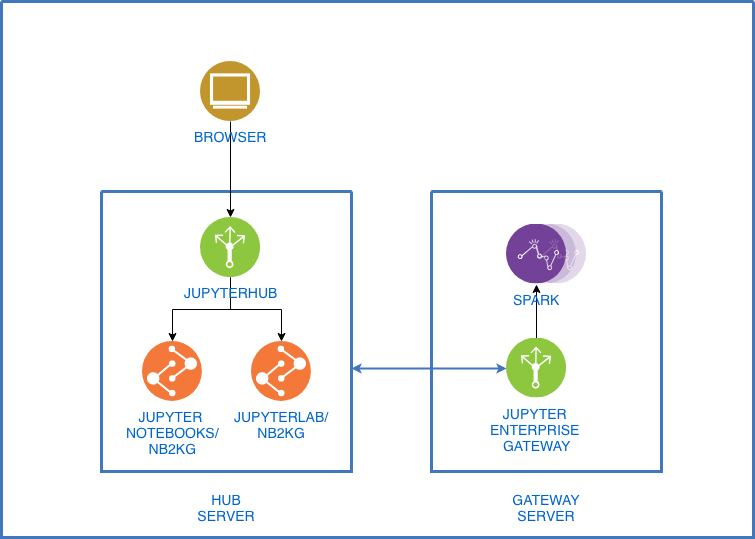

# Creating a Data Science platform with JupyterHub, Jupyter Enterprise Gateway, and Spark 2.4

This is POC contains files and instructions necessary to stand up a running instance of a multiuser notebook server that connects to a Spark cluster.

```bash

├── README.md                               <-- This instructions file
├── design.xml                              <-- Diagram source file (for draw.io)
├── design.png                              <-- Diagram
├── HUB_config                              <-- Configuration files for JupyterHub
├── JEG_config                              <-- Configuration file for Jupyter Enterprise Gateway (FYI, but not used)
└── kernels                                 <-- Pre-configured kernels
```

## Components

* [JupyterHub notebook server](https://github.com/jupyterhub/jupyterhub)
* [nb2kg](https://github.com/jupyter/nb2kg)
* [Spark 2.4](https://github.com/apache/spark)
* [Jupyter Enterprise Gateway](https://github.com/jupyter/enterprise_gateway)
* [JupyterLab (the next generation of notebooks)](https://blog.jupyter.org/jupyterlab-is-ready-for-users-5a6f039b8906)



The user interacts with JupyterHub, which serves as the notebook/authentication endpoint. Users can be managed in a variety of ways, but for this simple POC we're using PAM.

> JupyterHub spawns, manages, and proxies multiple instances of the single-user Jupyter notebook servers.

JupyterHub will create a notebook (or lab) with an associated kernel. NB2KG is an extension that will be used to connect to the Jupyter Enterprise Gateway).

It can be accessed with this url:

``http:<server>:8000/user/hubadmin/tree`` (for notebooks) or 

``http:<server>:8000/user/hubadmin/lab`` (for lab)

> NB2KG enables the Notebook server to use remote kernels hosted by a Jupyter "Gateway". It effectively hijacks the /api/kernels and /api/kernelspecs endpoints and forwards the requests to the Gateway server rather than launching a local kernel.

The Jupyter Enterprise Gateway's responsibility is to launch kernels and provide an HTTP API interface to them.

> Jupyter Enterprise Gateway enables Jupyter Notebook to launch remote kernels in a distributed cluster, including Apache Spark managed by YARN, IBM Spectrum Conductor, Kubernetes, Docker Swarm, DSE, or even regular Python Kernels. It provides out of the box support for R, Python, and Scala.

## Installing Jupyter Enterprise Gateway

For this POC, JEG serves requests to plain vanilla Spark 2.4. Again, these instructions were created on Ubuntu 18.0.4 on an AWS EC2 M4 Large instance. Other combinations may vary a bit.

Make sure the server is running the latest software.
```bash
sudo apt update
sudo apt upgrade
```

Install Java 8 (needed for Spark) and PyPi 3.

```bash
sudo apt install openjdk-8-jdk
sudo apt install python3-pip
```

Now, install Spark (I put it in ``/opt``):

```bash
wget http://ftp.naz.com/apache/spark/spark-2.4.0/spark-2.4.0-bin-hadoop2.7.tgz
sudo tar -xvf spark-2.4.0-bin-hadoop2.7.tgz -C /opt
```

I like to create soft links so that I can easily upgrade versions later. The python link is simply for convenience.
```bash
sudo ln -s /opt/spark-2.4.0-bin-hadoop2.7 /opt/spark
sudo ln -s /usr/bin/python3 /usr/bin/python
```

Set the environment variables

``bash
sudo vim /etc/environment
```

Add these settings:
```bash
SPARK_HOME=/opt/spark
JAVA_HOME=/usr/lib/jvm/java-8-openjdk-amd64
PYSPARK_PYTHON=python3
KG_LIST_KERNELS=True
JUPYTER_DATA_DIR=/usr/local/share/jupyter
PATH="$SPARK_HOME/bin:$JAVA_HOME:/usr/local/sbin:/usr/local/bin:/usr/sbin:/usr/bin:/sbin:/bin"
```
> Path settings are an example (they were what was in there previously on my installation). The important thing to consider is that you want to add ``$SPARK_HOME/bin:$JAVA_HOME:``. Even though we haven't installed JEG or Jupyter yet, we took the opportunity to sneak the settings in. ``KG_LIST_KERNELS`` will let you access the ``/api/kernelspecs`` and ``/api/kernels`` endpoints if you need to debug. ``JUPYTER_DATA_DIR`` will tell Jupyter where the kernels are.

Now, source the settings back
```bash
source /etc/environment
```

Test Spark to make sure we installed it right. Open a pyspark session (remember ``exit()`` gets you out of the REPL).

```bash
pyspark
```

We also want Jupyter to be installed outside of the user level. The ``/usr/local/share/jupyter`` is the place we're going to put kernels and configuration files.
```bash
sudo mkdir /usr/local/share/jupyter
sudo mkdir /usr/local/share/jupyter/kernels
sudo apt install jupyter-core
sudo apt install jupyter
```

Install Notebook (which gives us the prerequisites we need).

```bash
pip3 install jupyter
pip3 install notebook
```

Test our Jupyter installation. We should see version and a list of kernels (at least python3).
```bash
jupyter --version
jupyter kernelspec list
```

Now, copy the ``spark_python_standalone`` folder from inside the [kernels](kernels) folder to ``/usr/local/share/jupyter/kernels`` we made earlier.

> Be sure to maintain the folder structure.

> ``kernel.json`` contains the environment variables needed to be passed to the kernel.
> Be sure ``SPARK_HOME``, ``JAVA_HOME``, and ``PYSPARK_PYTHON`` are correct. They match these instructions, but when creating a new kernel, take care to set those properly. ``--master`` in ``SPARK_OPTS`` needs to match your installation. Since in our case we're connecting to a Spark standalone instance on this machine, ``local`` is appropriate. If using Yarn or some other method, you'll notice this will change from kernel to kernel. For example, it could be ``yarn``, ``spark://<server>:7077``, ``dse:///``, etc.

> Included are many of the scripts included here: https://github.com/jupyter/enterprise_gateway/releases/. For scala kernels (since those require large jar files), download and unzip them to get the kernels.

Set the run script with the appropriate rights (this will be kicked off when a kernel is created). If this isn't right, you'll get strange errors trying to access Spark Context from your notebook.
```bash
sudo chmod +x /usr/local/share/jupyter/kernels/spark_python_standalone/bin/run.sh
```

Listing the kernel specs ``jupyter kernelspec list`` should now additionally show:

```bash
spark_python_standalone    /usr/local/share/jupyter/kernels/spark_python_standalone
```

Install Jupyter Enterprise Gateway

```bash
sudo apt-get install gcc python-dev libkrb5-dev
pip3 install pywinrm[kerberos]
pip3 install --upgrade jupyter_enterprise_gateway
```

Start the Enterprise Gateway.

```bash
jupyter enterprisegateway --ip=0.0.0.0 --port_retries=0
```

>This server's address is the one to be used in the ``KG_URL`` (``http://<server>:8888``) parameter in Hub (below).

> This launches in interactive mode. It's a good way to test the setup so that you can see console errors. Once you're happy, run this as a service using your preferred method.

You can test the JEG installation by opening a browser (assuming you opened the port to public), or curl this:
```bash
http://<server>:8888/api/kernelspecs
```

That should give you a JSON representation which matches what you saw in ``jupyter kernelspec list``.

> If using AWS EC2, be sure to use the internal address. Servers in the same VPC must communicate via the internal address.

## Installing the Hub Server

These instructions were creating on Ubuntu 18.0.4 on AWS EC2. Other Linux and server configurations may vary slightly. We need to install at the server level because this will be a multi-user environment. That will make our lives easier.

Ensure that the server is up to date:

```bash
sudo apt update
```

NodeJS (and its package manager) is used by several components of JupyterHub, so we'll need to install that.

```bash
sudo apt-get install nodejs npm
```

Install the ``configurable-http-proxy`` globally.
```bash
sudo npm install -g configurable-http-proxy
```

Here, we've chosen to use Python 3. We'll need PyPi.
```bash
sudo apt install python3-pip
```

Install JupyterHub
```bash
sudo -H pip3 install jupyterhub
```

Install the notebook server, and if you want JupyterLab, install that, too.
```bash
sudo -H pip3 install notebook
sudo -H pip3 install jupyterlab
```

Verify that things have been installed correctly so far. Each of these should give you some help screens.
```bash
jupyterhub -h
configurable-http-proxy -h
```

Install the nb2kg extension and verify that nb2kg has installed correctly

```bash
sudo -H pip3 install nb2kg
sudo jupyter serverextension enable --py nb2kg --sys-prefix
jupyter serverextension list
```

Add a ``hubadmin`` user. This will be needed since we're using PAM. Choose an appropriate password.

```bash
sudo adduser hubadmin
```

Now, create a server-level configuration folder and move the configuration files in (from [HUB_config](HUB_config) ).

```bash
sudo mkdir /etc/jupyter
sudo vim /etc/jupyter/jupyterhub_config.py #(or copy)
sudo vim /etc/jupyter/jupyter_notebook_config.py #(or copy)
```
> ``jupyterhub_config.py`` contains 2 important settings. ``c.Authenticator.admin_users = {'hubadmin'}`` enables the administrative functions for the hubadmin user we just created. ``c.Spawner.env_keep = ['PATH', 'KG_URL']`` will pass the environment variables we need to the new notebook processes created by hub. This is critical.

> ``jupyter_notebook_config.py`` is the key to this entire thing on the hub server. It is what uses nb2kg to hijack the kernelspec manager (what lists the kernels available in the dropdown on notebooks), and the kernel manager (what spawns new kernels and connects to them).

### Environment Variables
> As mentioned, it's critical to properly set environment variables and ensuring they are able to be passed from process to process through Linux's security boundary.

We can set environment variables in a few ways. We could edit ``/etc/environment`` like so:

```bash
sudo vim /etc/environment
```
And add these:
```text
KG_URL=http://<my gateway>:8888
KG_REQUEST_TIMEOUT=30
VALIDATE_KG_CERT=no
JUPYTER_CONFIG_DIR=/etc/jupyter
...
```

```bash
source /etc/environment
```

Or, we could pass them into the process through the terminal, like this:

```bash
sudo KG_URL=http://172.31.75.79:8888 jupyterhub -f /etc/jupyter/jupyterhub_config.py
```

We ran the hub server with ``sudo`` so that it can spawn new processes in behalf of new users. This example shows how to do it in interactive mode, but you can choose to run it as a service using your favorite method.

> ``-f`` switch tells it we want to use this configuration file. It will default to use the location specified in the env variable ``JUPYTER_CONFIG_DIR`` otherwise and look for a file named ``jupyterhub_config.py``.

Open a browser and navigate to ``http://<server>:8000`` and login with ``hubadmin`` using the password you created earlier.

## Future Work

* Security other than PAM (you likely use OAuth or LDAP in your organization).
* HTTPS between JEG and Hub.
* Use Kubernetes for containers Hub and JEG. It provides a more robust environment, but requires some experience therein. (the virtues are extolled here: https://blog.jupyter.org/introducing-jupyter-enterprise-gateway-db4859f86762)
* Additional Kernels. Depending on preferences (R, Scala, Scikit) you may want to include those in your installation.
* Other tools: MLeap and Pixie Dust, sklearn and any other preferred tools.
* Spark Cluster: In this POC, the stack is installed on a single, standalone Spark node. The production environment will differ, so pay attention to the steps outlined in the configuration.